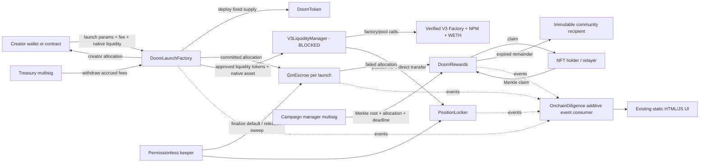

# Threat Model and Trust Boundaries

**Assessment status:** pre-audit design review. This document does not establish production readiness.

## Assets

- Fixed token supply and allocation integrity.
- Creator escrow allocation.
- Native asset supplied for liquidity.
- V3 position NFT and its lock terms.
- Failed-launch reward inventory.
- Merkle campaign inventory and claim correctness.
- Accrued launch fees.
- Canonical launch/commitment data consumed by OnchainDiligence.

## Actors

- Creator.
- Token buyer/market participant.
- DoomStreak NFT holder.
- Permissionless keeper/finalizer/relayer.
- Treasury multisig.
- Campaign-manager multisig.
- Unclaimed-reward community recipient.
- Robinhood Chain RPC/indexer operator.
- Verified V3 deployment contracts.
- Malicious token metadata submitter, reentrant contract creator, compromised frontend, malicious RPC, and compromised multisig signer.

## Trust-boundary diagram

The most important unimplemented trust boundary is the concrete V3 adapter. Its dependencies, token ordering, pool derivation, approval lifecycle, native wrapping, mint/refund behavior, and NFT transfer must be independently verified before code is added.

## Primary threats and controls

| Threat | Impact | Current control | Remaining work |
|---|---|---|---|
| Hidden token control/mint | Supply theft/dilution | Ownerless ERC-20; one constructor mint | Audit bytecode and deployment args |
| Allocation arithmetic error | Misallocated supply | BPS sum check; remainder to escrow; fuzz tests | Approve product bounds |
| Early creator release | Commitment bypass | Scheduled windows and terminal state | Timestamp/sequencer review |
| Early/duplicate default | Reward theft | Deadline check; terminal state; tests | Keeper monitoring |
| Reentrancy during launch/refund/withdraw | Duplicate launches/accounting corruption | ReentrancyGuard, CEI, exact approvals, safe calls | V3 adapter review |
| Malicious/incorrect V3 addresses | Asset loss/fake lock | No addresses embedded; manager validity hook; factory reads the locker directly | Verified address package and code-hash checks |
| Fake pool/position return | False badge, asset loss | Non-zero return, exact token consumption, direct locker metadata/ownership validation | Concrete manager must verify NPM ownership and pool derivation |
| LP NFT early withdrawal | Liquidity removal | Ownerless locker; fixed unlock/beneficiary | Decide permanent/time-limited policy |
| Locked fee extraction backdoor | Hidden value path | Locker has no collect/rescue/admin function | Decide intended fee treatment |
| Reward double claim | Inventory loss | Per-campaign bitmap-style mapping and Merkle proof | Merkle generator test vectors |
| Merkle root abuse | Unfair rewards | Immutable campaign-manager multisig | Governance/runbook and published manifest |
| Unclaimed reward discretion | Treasury leakage | Immutable recipient; permissionless sweep | Approve recipient policy |
| Reward deposit spoofing | Misleading analytics | Vault requires a real transfer; escrow verifies source/vault balance deltas | Indexer must trust only known escrow source |
| Smart-contract refund rejection | Launch denial | Atomic revert; exact-value payment supported | Decide alternate refund recipient feature |
| Treasury rejects native payment | Fees temporarily locked | Withdrawal reverts without losing accounting | Treasury compatibility rehearsal |
| Malicious metadata | UI injection/phishing | Contracts treat strings as data | Static UI escaping and content policy |
| RPC/indexer reorg/staleness | Wrong badges/history | Existing cursor/idempotency protections | Add event confirmation and rollback policy |
| Compromised frontend | Bad params/signatures | Contract validation; public facts | Transaction simulation and human-readable review |
| Admin key compromise | Campaign abuse/fee access | Immutable least-privilege roles | Multisig, hardware keys, monitoring |

## Invariants

1. Token total supply never changes after construction.
2. Launch allocations reconcile exactly to total supply.
3. Factory holds no launch tokens after success.
4. Escrow terminal state is exactly one of completed/defaulted.
5. Escrow releases/deposits exactly once.
6. Default cannot be finalized until after the current deadline.
7. LP release cannot occur before unlock.
8. LP release destination cannot be changed.
9. Claimed plus remaining campaign allocation never exceeds campaign total.
10. An account cannot claim twice in one campaign.
11. Accrued fees cannot exceed native balance retained by the factory for fees.
12. Safety-critical status remains publicly queryable.

## Assumptions requiring validation

- Robinhood Chain timestamp behavior is suitable for daily cadence enforcement.
- The selected V3 deployment matches the interfaces used by the future adapter.
- The position manager's NFT ownership semantics are standard ERC-721.
- The wrapped native token does not have non-standard transfer behavior.
- Treasury, campaign manager, and community recipient are correctly configured multisigs/contracts.
- Off-chain Merkle generation uses the exact leaf encoding and snapshot policy.
